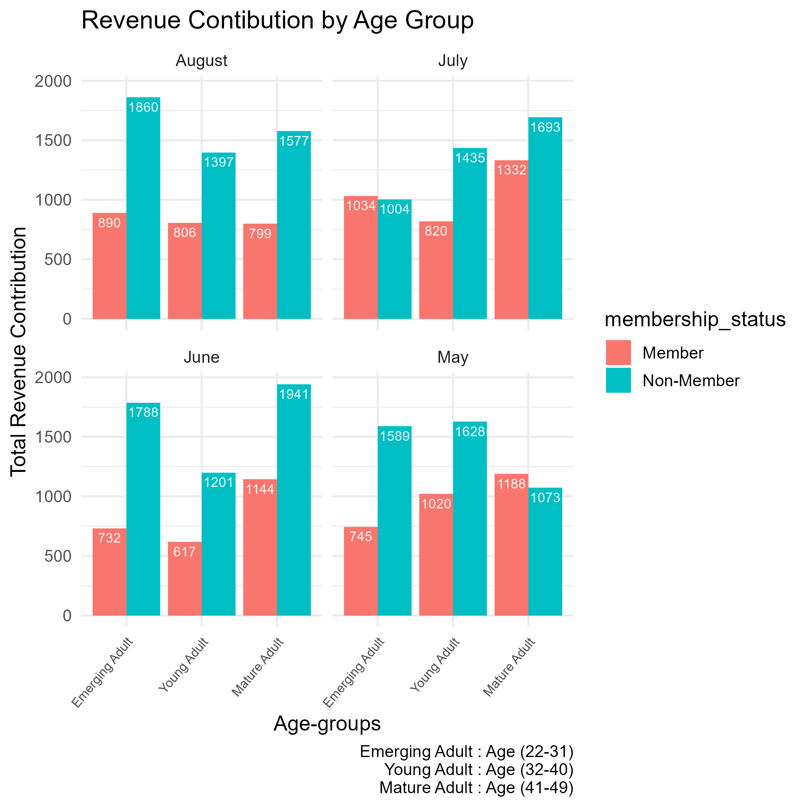
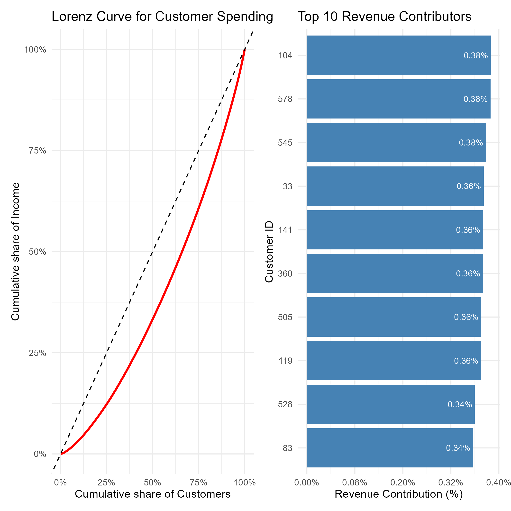

# Bean & Brew Coffee Shop — Customer & Revenue Analytics in R

End-to-end R pipeline that transforms raw, semi-structured order data from a coffee shop into clean relational tables, a parameter-driven customer reporting tool, and business-facing revenue visualisations.

**Tech stack:** R · tidyverse (dplyr, tidyr, stringr) · lubridate · ggplot2 · scales · patchwork

---

## Overview

Bean & Brew records every customer order — items, quantities, prices, discounts, delivery type — in a single nested data file. This project delivers the full analytics layer on top of that raw data: clean relational tables, an automated billing and discount engine, an on-demand customer lookup tool, and two visualisations designed to surface actionable insight for operational and strategic decision-making.

The dataset covers May–August 2025 and includes order ID, date, discount code, order type (Dine In / Deliveroo), customer details (name, ID, date of birth, membership status), and nested lists of products, quantities, and unit prices per order.

## Key Features

**1. Data decomposition and cleaning**
- Parsed deeply nested, stringified list-columns (products, quantities, prices stored as vectors within a single field) and unnested them into a tidy, one-row-per-line-item structure.
- Split the raw dataset into three normalised tables ready for database ingestion: `customers`, `items_in_orders`, and `orders`.
- Derived customer age from date of birth as of a fixed benchmark date, and split full names into first/last name fields programmatically.

**2. Automated order financial logic**
Business pricing rules are implemented as repeatable, parameter-driven logic — not manual calculation:
- 10% loyalty discount auto-applied to members on the first day of each month (`MEMBER10`), and a 5% promo code (`OFF5`) available to any customer — with the larger of the two automatically taking precedence when both apply.
- 12% VAT applied to the post-discount subtotal.
- £1.99 delivery fee conditionally applied to Deliveroo orders only.
- All monetary fields rounded consistently to two decimal places across the pipeline.

The discount, VAT, and fee logic are expressed as reusable rules rather than hard-coded per-row values, making the structure straightforward to extend with new discount codes, fee tiers, or membership rules.

**3. On-demand customer reporting function**
A validated R function that accepts a customer ID and date range and returns:
- A general stats table — full name, age, order count, dine-in vs. delivery split, and mean/median order value.
- A product stats table — proportion of each product ordered within that window.
- A formatted, receipt-style printed summary.

Includes input validation (numeric customer ID, strict `YYYY-MM-DD` date format) with re-prompting on invalid input, and a graceful no-records message when no orders exist for the given customer/date combination.

**4. Business-facing visualisations**
- **Revenue by age group and membership status** (faceted column chart, by month): shows non-members consistently outspending members across the observed period, with Emerging Adults (22–31) the leading revenue segment in most months.
- **Lorenz curve of customer revenue concentration**, paired with a top-10 customer ranking: quantifies how concentrated revenue is — the top 10% of customers generate over 25% of total revenue — directly motivating targeted retention and loyalty engagement with high-value customers.

## Repository Structure

```
.
├── Code_&_Analysis/
│   └── Retail Coffee Shop Project.Rmd   # Full R Markdown source (data prep, function, visualisations)
├── Dataset/
│   └── raw_orders_coffee.csv            # Raw order data
├── Visualizations/
│   ├── Age_revenue_contribution.png     # Revenue by age group and membership status chart
│   └── lorenz_curve.png                 # Lorenz curve and top-10 customer revenue chart
├── LICENSE
└── README.md
```

## Sample Output

**Revenue contribution by age group and membership status**

Non-members outspend members in nearly every month observed; Emerging Adults are the leading revenue segment overall.

**Lorenz curve and top 10 revenue contributors**

The top 10% of customers contribute over 25% of total revenue, indicating meaningful dependence on a small base of high-value customers.





## How to Run

1. Clone this repository.
2. Open `Code_&_Analysis/Retail Coffee Shop Project.Rmd` in RStudio.
3. Install dependencies if needed:
   ```r
   install.packages(c("tidyverse", "lubridate", "ggplot2", "scales", "patchwork"))
   ```
4. Knit the file to PDF or HTML to reproduce the full report.

## Technical Highlights

- Parsing and reshaping semi-structured/nested data into normalised, analysis-ready tables
- Translating business pricing rules (discounts, tax, conditional fees) into deterministic, reusable calculation logic
- Function design with input validation and defensive handling of edge cases
- Data visualisation and written insight communication for a non-technical audience
- Reproducible reporting via R Markdown / knitr
